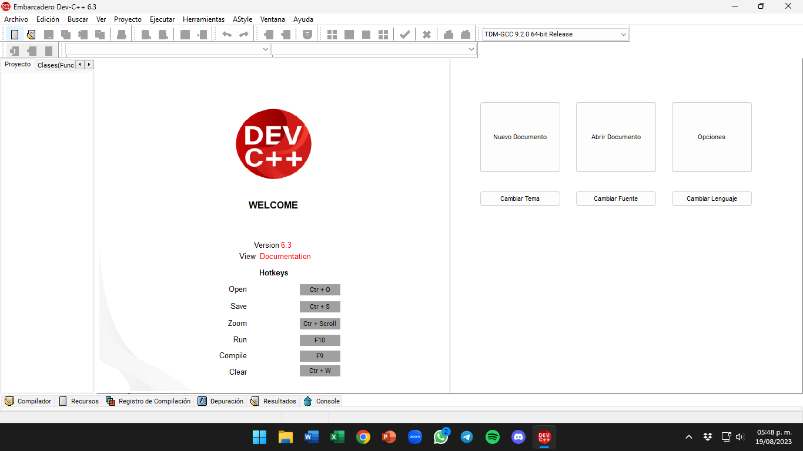
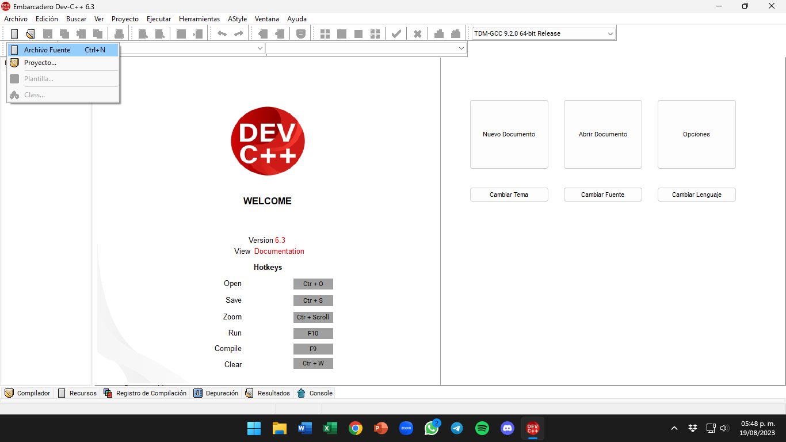
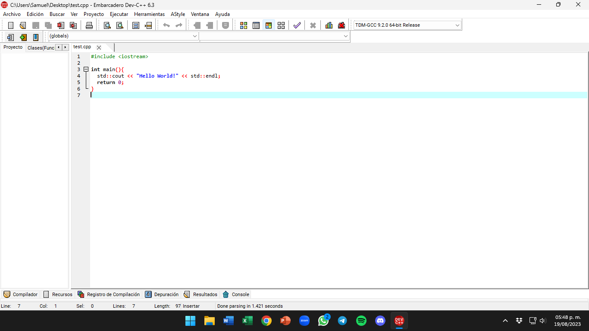
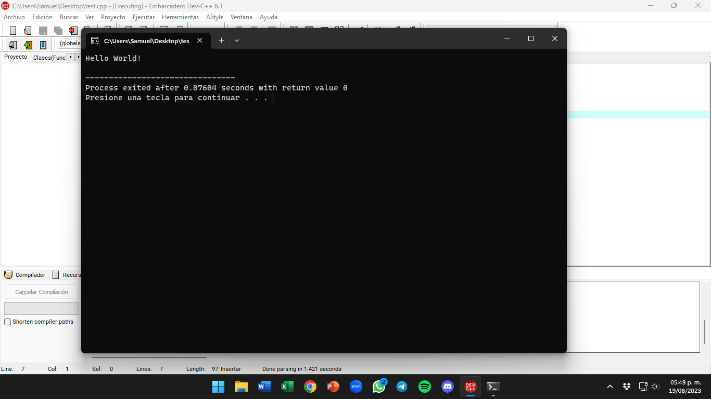

# Configura DevCpp ⚙️

Si tomaste la opción de `DevCpp` como tu IDE entonces esta es tu sección, si no es así vuelve a la sección *[Configura tu entorno](./README.md)* y selecciona otro enlace.

## Tabla de Contenidos 🔍

- [Instalación](#instalación-)
- [Ejemplo de uso](#ejemplo-de-uso-)

## Instalación 📩

Para el caso de `DevCpp` el software solo se encuentra disponible para Windows, si tú estás utilizando Linux, macOS o cualquier otro sistema te recomiendo usar una de las otras opciones listadas en la sección *[Configura tu entorno](./README.md)*.

1. Primero necesitarás acceder a la sección de *releases* del GitHub del proyecto en [este link](https://github.com/Embarcadero/Dev-Cpp/releases).
2. Identifica cuál opción necesitas, ya sea la versión instalable o portable.
    - En caso de usar la versión instalable, descarga el archivo `Embarcadero_Dev-Cpp_X.X_TDM-GCC_X.X_Setup.exe`.
    - En caso de usar la versión portable, descarga el archivo `Embarcadero_Dev-Cpp_X.X_TDM-GCC_X.X_Portable.7z`.
      - En caso de usar la versión portable necesitarás algún programa para descomprimir archivos, prueba [7zip](https://www.7-zip.org/) para esto.
    - Si no puedes ver ninguna opción de descarga, asegúrate de desplegar el menú llamado `Assets` al final de la sección para la última versión disponible.
3. Si tienes la versión portable, descomprime el archivo y copia la carpeta resultante en el lugar de tu elección. Si cuentas con la versión instalable, sigue las instrucciones del instalador.
    - Para ejecutar la versión portable necesitarás entrar en la carpeta que descomprimiste y buscar el archivo ejecutable con terminación en `.exe`.

## Ejemplo de uso 🧠

1. Podemos crear un archivo nuevo si damos click en el primer icono de arriba a la izquierda y después en `Archivo fuente`, o también podemos usar el atajo de teclado `Ctrl+N`.

 

2. Una vez tengamos nuestro código terminado o queramos ejecutarlo, solo tenemos que presionar el icono con forma de *ventana con marcos* que está en la parte superior central. Este botón nos permite compilar y ejecutar el código. También podemos usar el atajo de teclado `F11`.

 

***NOTA:*** Este IDE también nos permite compilar y gestionar grandes proyectos de una forma muy sencilla, pero esa característica no será necesaria para esta guía.

<table><tr>
  <td><b><a href="./README.md"><=  Configurando un entorno  </a></b></td>
  <td><b><a href="../definitions/README.md#conceptos-básicos-">  Conceptos básicos  =></a></b></td>
</tr></table>
