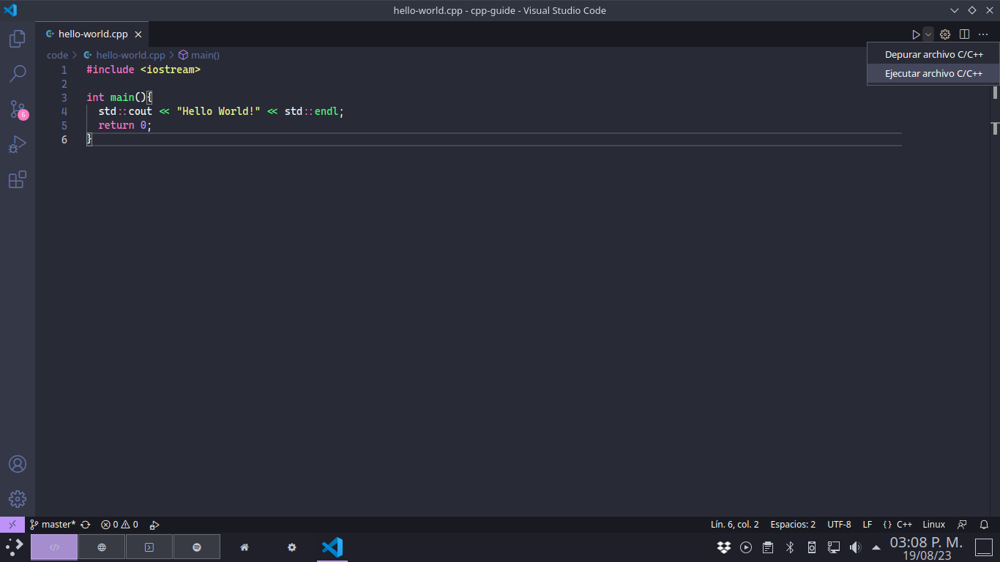
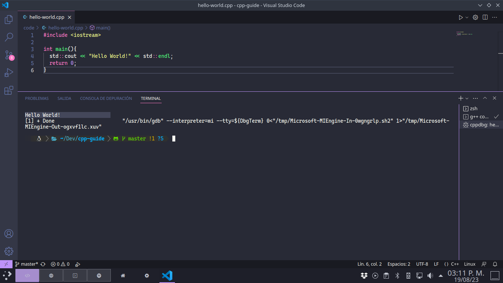

# **Configura VS Code**

Si tomaste la opción de `Visual Studio Code` como tu IDE entonces esta es tu sección, si no es así vuelve a la sección *[Configura tu entorno](./README.md)* y selecciona otro enlace.


## Tabla de Contenidos

- [Instalar VS Code](#instalar-vscode)
- [Instalar un Compilador](#instalar-vscode)
  - [Windows](#windows)
  - [MacOS](#macos)
  - [Linux](#linux)
- [Configurar la extensión C/C++]()
- [Ejemplo de uso](#ejemplo-de-uso)


## Instalar VS Code

1. Accede a la web oficial en su sección de descargas con [este link](https://code.visualstudio.com/download).
2. Identifica la versión que prefieras, te recomiendo usar el gran botón azul correspondiente a tu sistema operativo.
3. Ejecuta el archivo que descargaste y sigue las instrucciones del instalador.


## Instalar un Compilador

### Windows

En Windows existen muchísimas opciones para configurar un compilador de C++, la opción que te recomiendo es `MSYS2` , puedes usar [esta guía](https://www.freecodecamp.org/news/how-to-install-c-and-cpp-compiler-on-windows/).

En caso de que estés en un sistema de 32bits o prefieras usar otra opción, te recomiendo dar un vistazo en [esta web](https://www.mingw-w64.org/downloads/) donde puedes encontrar varias opciones. Una de estas opciones que recomiendo es `Mingw-builds` , puedes acceder a sus descargas en [este link](https://github.com/niXman/mingw-builds-binaries/releases) de su página de GitHub.


### MacOS

Existen varias opciones para instalar C++ en macOS, puedes instalar el entorno completo de `XCode` desde la Mac Store o desde este link, esto te dará acceso a c++ desde la terminal.

O puedes optar por instalar solo el paquete de línea de comandos, para esto basta con poner en la terminal el siguiente comando.

```bash
xcode-select --install
```

Después de esto saltará una ventana en la cual deberás presionar `Instalar` y poner tu contraseña.


### Linux

La gran mayoría de distribuciones de Linux cuentan con el compilador de `GCC` así que no deberías de necesitar instalarlo, puedes comprobarlo ejecutando el siguiente comando.

```bash
g++ --version
```

Si obtienes algún error al ejecutar el comando es posible que el compilador no esté instalado o no tengas acceso a su ejecutable desde tu usuario, de ser este el caso te recomiendo buscar en guías oficiales de tu distribución.


## Configurar la extensión C/C++

Para esto bastará con instalar las extensiones necesarias y estás automáticamente buscarán el compilador en tu sistema (claro, si realizaste la instalación adecuadamente).

1. Abre `VS Code` y dirígete a la pestaña de extensiones que está en el panel izquierdo, también puedes usar `Ctrl+Shift+X`.
2. Busca la extensión llamada `C/C++` e instálala, puedes usar también la extensión llamada `C/C++ Extension Pack` que incluye funciones adicionales, pero podrías no necesitarlas, así que es opcional.
    - Esto debería de ser suficiente, pero en caso de que no puedas ejecutar tus programas, prueba a descargar la extensión llamada `Code Runner`.
    - Si después de esto sigue sin funcionar es probable que tu instalación del compilador haya fallado, te recomiendo buscar una guía específica para tu SO y arquitectura en internet.


## Ejemplo de uso

1. Una vez que queramos ejecutar nuestro código ***C/C++***, primero iremos a la parte superior derecha y presionaremos en la pequeña flecha que está después del icono de `Play`.

<br>

2. Después usaremos la opción que dice `Ejecutar archivo C/C++`.

<br>
 
3. Aquí se nos mostrarán las opciones que la extensión encontró en nuestro sistema, si la lista está vacía es probable que la instalación del compilador sea incorrecta. Recomiendo la opción llamada `C/C++: g++ Compilar y depurar el archivo activo`.

<br>

4. Después de dar click se debería de desplegar debajo una ventana similar, puede tardar un rato dependiendo de la potencia de tu equipo y la carga de tu programa. Después de un rato debería de estar listo y ejecutarse tal como se ve abajo.

<br>

**Nota:** Estos pasos solo se tienen que hacer la primera vez, después de eso el editor guarda la configuración del proyecto y solo será necesario presionar el botón de `Play` que está en la parte superior derecha.


<hr><div align="center"><table><tr>
  <td><b><a href="./README.md"><=  Configurando un entorno  </a></b></td>
  <td><b><a href="../definitions/README.md#conceptos-básicos">  Conceptos básicos  =></a></b></td>
</tr></table></div>