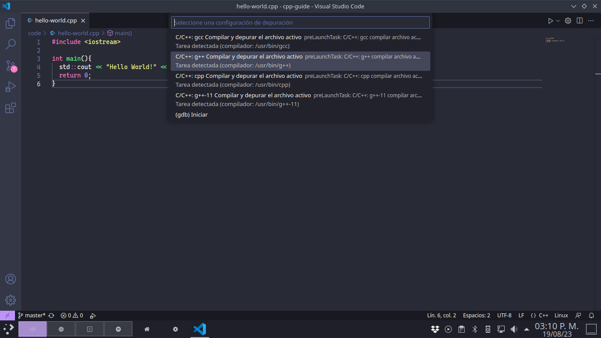

# **Configura VSCode**

Si tomaste la opción de Visual Studio Code como tu IDE entonces esta es tu sección, si no es así vuelve a la sección *[Configura tu entorno](./README.md)* y selecciona otro enlace.


## Tabla de Contenidos

- [Instalar VSCode](#instalar-vscode)
- [Instalar un Compilador](#instalar-vscode)
  - [Windows](#windows)
  - [MacOS](#macos)
  - [Linux](#linux)
- [Configurar la extensión C/C++]()
- [Ejemplo de uso](#ejemplo-de-uso)


## Instalar VSCode

1. Accede a la web oficial en su sección de descargas con [este link](https://code.visualstudio.com/download).
2. Identifica la versión que prefieras, te recomiendo usar el gran boton azul correspondiente a tu sistema operativo.
3. Ejecuta el archivo que descargaste y sigue las instrucciones del instalador.


## Instalar un Compilador

### Windows

En windows existen muchisimas opciones para configurar un compilador de C++, la opción que te recomiendo es MSYS2, puedes usar [esta guia](https://www.freecodecamp.org/news/how-to-install-c-and-cpp-compiler-on-windows/).

En caso de que estes en un sistema de 32bits o prefieras usar otra opcion te recomiendo dar un vistazo en [esta web](https://www.mingw-w64.org/downloads/) donde puedes encontrar varias opciones. Una de estas opciones que recomiendo es Mingw-builds, puedes acceder a sus descargas en [este link](https://github.com/niXman/mingw-builds-binaries/releases) de su pagina de Github.


### MacOS

Existen varias opciones para instalar C++ en MacOS, puedes instalar el entorno completo de `XCode` desde la MacStore o desde este link, esto te dara acceso a c++ desde la terminal.

O puedes optar por instalar solo el paquete de linea de comandos, para esto basta con poner en la terminal el siguiente comando.

```bash
xcode-select --install
```

Despues de esto saltara una ventana en la cual deberas presionar `Instalar` y poner tu contraseña.


### Linux

La gran mayoria de distribuciones de linux cuentan con el compilador de `GCC` así que no deberias de necesitar instalarlo, puedes comprobarlo ejecutando el siguiente comando.

```bash
g++ --version
```

Si obtienes algun error al ejecutar el comando es posible que el compilador no este instalado o no tengas acceso a su ejecutable desde tu usuario, de ser este el caso te recomiendo buscar en guias oficiales de tu distribución.


## Configurar la extensión C/C++

Para esto bastara con instalar las extensiones necesarias y estas automaticamente bucaran el compilador en tu sistema (si realizaste la instalación adecuadamente claro).

1. Abre VSCode y dirigete a la pestaña de extensiones que esta en el panel izquierdo, tambien puedes usar `Ctrl+Shift+X`.
2. Busca la extensión llamada `C/C++` e instalala, puedes usar tambien la extensión llamada `C/C++ Extension Pack` que incluye funciones adicionales, pero podrias no necesitarlas asi que es opcional.
    - Esto deberia de ser suficiente, pero en caso de que no puedas ejecutar tus programas prueba a descargar la extensión llamada `Code Runner`.
    - Si despues de esto sigue sin funcionar es probable que tu instalación del compilador haya fallado, te recomiendo buscar una guía especifica para tu SO y arquitectura en internet.


## Ejemplo de uso

1. Una vez que qeuramos ejecutar nuestro codigo ***C/C++***, primero iremos a la parte superior derecha y presionaremos en la pequeña flecha que esta despues del icono de play.

<br>

2. Despues usaremos la opcion que dice `Ejecutar archivo C/C++`.

<br>
 
3. Aquí se nos mostraran las opciones que la extensión encontro en nuestro sistema, si la lista esta vacia es probable que la instalación del compilador este incorrecta. Recomiendo la opción llamada `C/C++: g++ Compilar y depurar el archivo activo`.

<br>

4. Despues de dar click se deberia de desplegar debajo una ventana similar, puede tardar un rato dependiendo de la potencia de tu equipo y la carga de tu programa. Despues de un rato deberia de estar listo y ejecutarse tal como se ve abajo.

<br>

**Nota:** Estos pasos solo se tienen que hacer la primera vez, despues de eso el editor guarda la configuración del proyecto y solo sera necesario presionar el boton de `play` que esta en la parte superior derecha.


<hr><div align="center"><table><tr>
  <td><b><a href="./README.md"><=  Configurando un entorno  </a></b></td>
  <td><b><a href="../definitions/README.md#conceptos-básicos">  Conceptos básicos  =></a></b></td>
</tr></table></div>