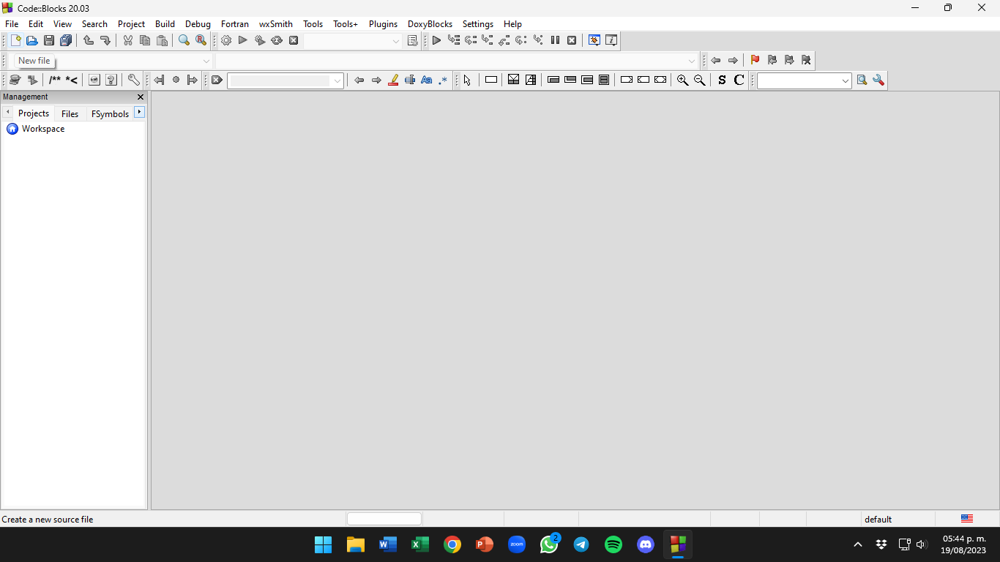
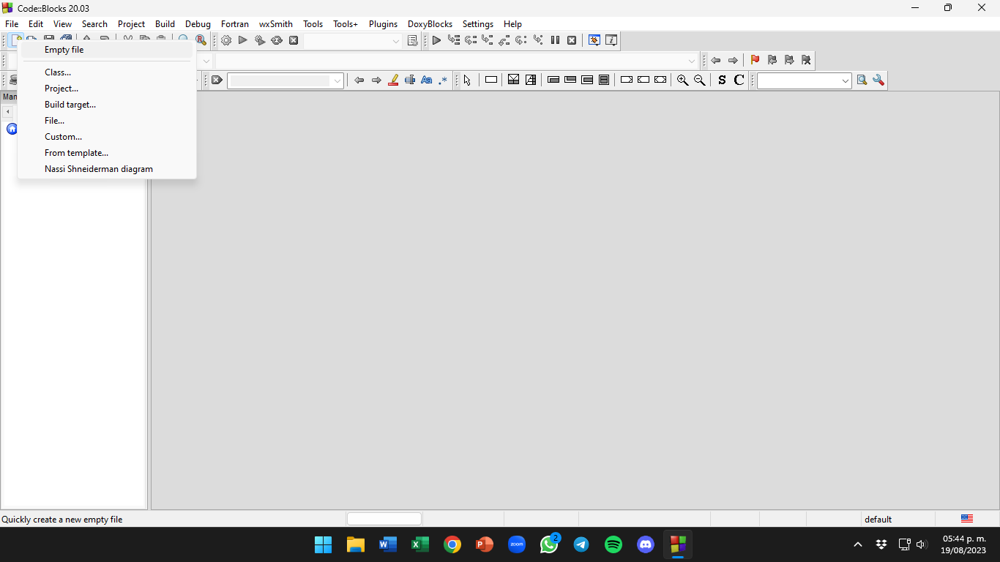
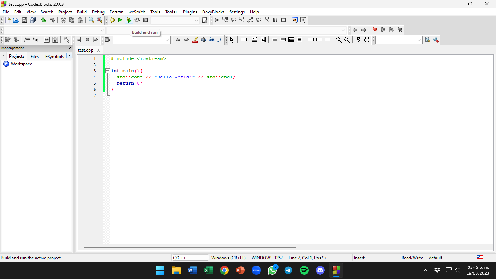
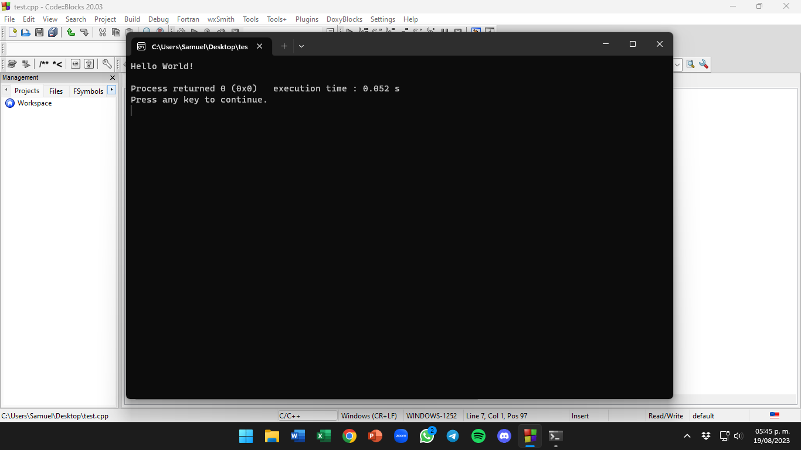

# Configura Code::Blocks ⚙️

Si tomaste la opción de `Code::Blocks` como tu IDE entonces esta es tu sección, si no es así vuelve a la sección *[Configura tu entorno](./README.md)* y selecciona otro enlace.

## Tabla de Contenidos 🔍

- [Instalación](#instalación-)
- [Ejemplo de uso](#ejemplo-de-uso-)

## Instalación 📩

Bien, el primer paso es verificar nuestras necesidades, pues la página oficial de `Code::Blocks` nos ofrece varias opciones para descargar el IDE, el primer paso sería determinar nuestro sistema operativo, la página nos ofrece las tres opciones más comunes (Windows, Linux y macOS), dado que la mayoría de los usuarios usan Windows me centraré en este SO *(además de que si eres usuario de Linux seguro sabrás como instalarlo)*.

1. El primer paso es entrar a la página de descargas usando [este enlace](https://www.codeblocks.org/downloads/binaries/).
2. Después dirígete a la sección que incluya tu sistema operativo.
3. Identifica cuál opción necesitas, en el caso de Windows yo te recomiendo la opción llamada `codeblocks-XX.XXmingw-setup.exe` dado que es más estable que la versión portable y cuenta con el compilador ya configurado.
    - Debes de saber la arquitectura de tu equipo, si es moderno la versión anterior debería de funcionar, de no ser así descarga la versión de 32bits `codeblocks-XX.XX-32bit-nosetup.zip`.
    - Es posible que te sea imposible tener acceso de administrador en tu perfil, en ese caso puedes descargar la versión que incluye la palabra `nonadmin`.
4. Dirígete a la página de descargar presionando una de las dos opciones `FossHUB` o `Sourceforge.net`.
    - Te recomiendo usar `Sourceforge.net` dado que la descarga iniciara automáticamente al entrar a la web.
5. Instala el IDE ejecutando el archivo descargado y siguiendo las instrucciones del instalador.

## Ejemplo de uso 🧠

1. Podemos crear un archivo nuevo si damos click en el primer icono de arriba a la izquierda y después en `Empty File`.

 

2. Una vez tengamos nuestro código terminado o queramos ejecutarlo, solo tenemos que presionar el icono con forma de *engranaje y play* que está en la parte superior central. Este botón nos permite compilar y ejecutar el código.

 

***NOTA:*** Este IDE también nos permite compilar y gestionar grandes proyectos de una forma muy sencilla, pero esa característica no será necesaria para esta guía.

<table><tr>
  <td><b><a href="./devcpp.md">⬅ DevCpp</a></b></td>
  <td><b><a href="./vscode.md">VS Code ⮕</a></b></td>
</tr></table>
